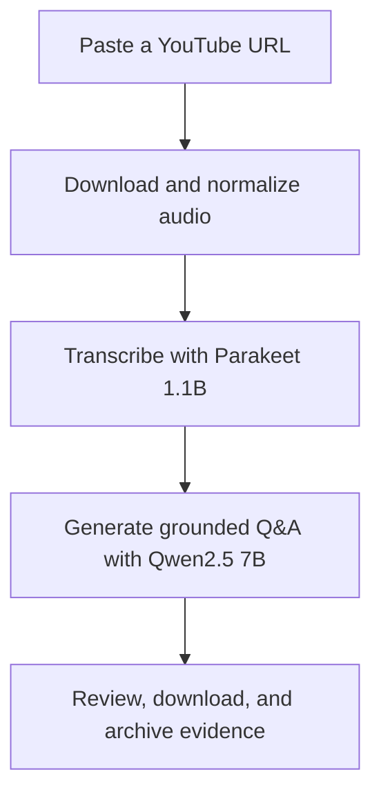
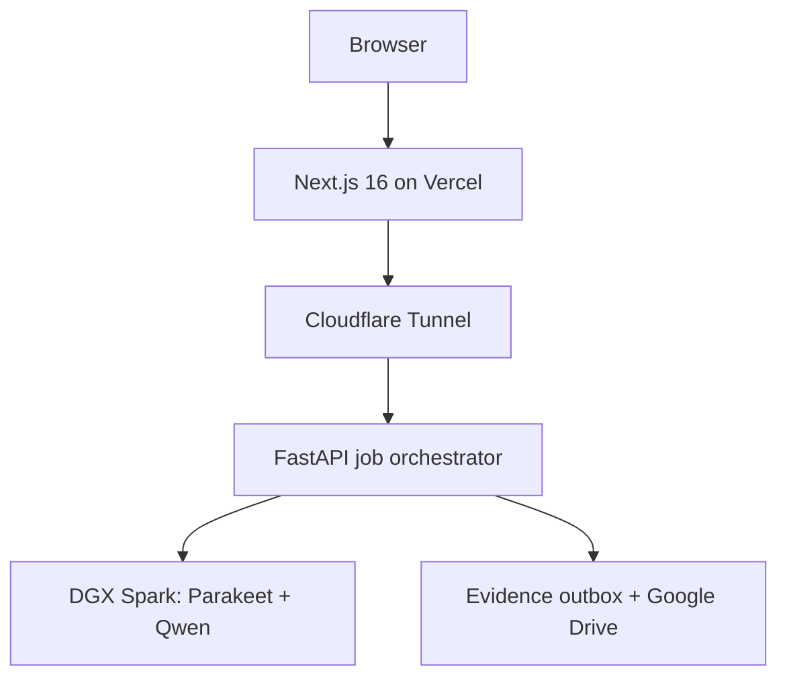
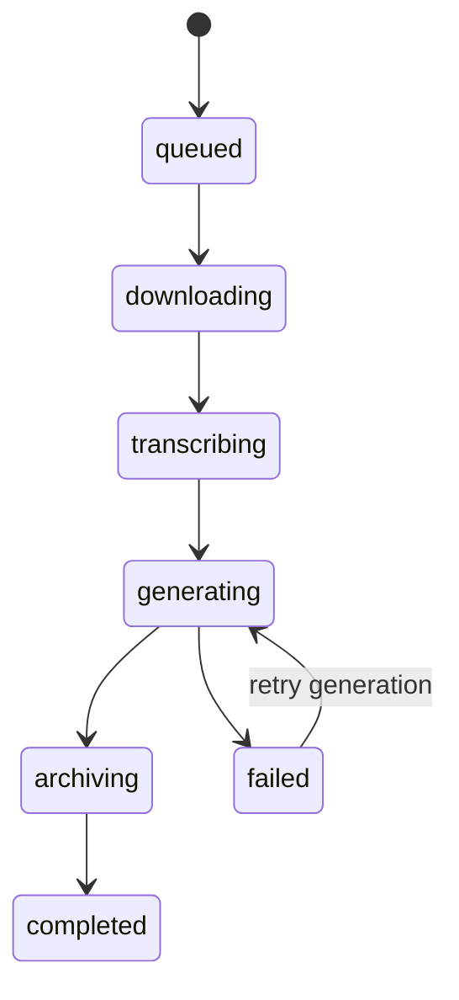

# Youtube2knowledge

<div align="center">

### Video in. Understanding out.

Turn any public YouTube video into a transcript and a grounded set of questions,
answers, and source evidence - powered locally by an NVIDIA DGX Spark.

[](https://youtube2knowledge.albertomunoz.ai/)
[](https://github.com/LuisAlbertoMunozUbando/youtube2knowledge/actions/workflows/ci.yml)
[](LICENSE)
[](https://www.nvidia.com/en-us/products/workstations/dgx-spark/)

[Try the live app](https://youtube2knowledge.albertomunoz.ai/) ·
[Explore the API](#api) ·
[Run on DGX Spark](#run-on-nvidia-dgx-spark) ·
[Read the full whitepaper](output/pdf/whitepaper-youtube2knowledge.pdf) ·
[LaTeX source](docs/whitepaper/whitepaper-youtube2knowledge.tex)

</div>

---

## Why Youtube2knowledge?

Watching a video is easy. Turning it into reusable, verifiable knowledge is not.
Youtube2knowledge performs the entire journey in one workflow:

1. Paste a YouTube URL.
2. Extract and normalize the audio.
3. Transcribe it with NVIDIA Speech NIM.
4. Choose the question lenses you care about.
5. Generate answers grounded in the transcript.
6. Preserve the source, transcript, answers, and evidence in Google Drive.

The result is not a generic summary. Every generated answer includes the exact
transcript excerpt used as evidence.

## Highlights

| Capability | What it gives you |
| --- | --- |
| **Eight Wh- lenses** | What, Which, Where, When, How, Why, Who, and Whose |
| **Custom questions** | Ask your own questions about the video |
| **Keyword focus** | Guide the model toward topics that matter to you |
| **Grounded answers** | Every answer carries a source excerpt from the transcript |
| **Local AI** | ASR and question generation run on the NVIDIA DGX Spark GPU |
| **Resilient jobs** | Refresh-safe polling, atomic state, and generation-only retries |
| **Portable results** | Download the complete knowledge set as JSON |
| **Durable archive** | JSON and Markdown evidence packages sync to Google Drive |

## How it works



The browser lets you select any combination of Wh- question types, add keywords,
include custom questions, choose the output language, and control how many
questions are generated per type.

## Production architecture



| Layer | Technology | Responsibility |
| --- | --- | --- |
| Web | Next.js 16, TypeScript, Vercel | Input, polling, recovery, and results |
| Edge | Cloudflare Tunnel | Secure public route to the Spark API |
| API | FastAPI, Pydantic, `yt-dlp`, FFmpeg | Validation, durable jobs, media processing |
| Speech | NVIDIA Speech NIM, Parakeet 1.1B | GPU-accelerated multilingual transcription |
| Reasoning | vLLM, Qwen2.5-7B-Instruct | Evidence-backed question and answer generation |
| Archive | Atomic JSON, Markdown, rclone, Drive | Durable records in `AnswersFromYoutubeVideos` |

Long-running media and GPU work deliberately stays outside Vercel. Only the web
interface is serverless; the AI pipeline runs on the Spark, where FFmpeg, model
weights, GPU memory, and persistent job data are available.

## AI models

| Model | Size | Role |
| --- | ---: | --- |
| NVIDIA Parakeet 1.1B RNNT Multilingual | 1.1B parameters | Multilingual speech recognition |
| Qwen2.5-7B-Instruct | 7B parameters | Structured questions, answers, and evidence |

Qwen is served through an OpenAI-compatible vLLM endpoint with a 32,768-token
context window. Parakeet uses the DGX Spark GB10-compatible multilingual offline
profile. Internal model ports bind only to loopback; the public edge exposes only
the FastAPI service.

For a deeper look at weights, transformer execution, attention, KV cache, and GPU
memory, see the [model-architecture appendix](output/pdf/appendix-model-architecture.pdf).

## Repository map

```text
youtube2knowledge/
├── apps/web/                Next.js 16 web application
├── services/api/            FastAPI processing service and tests
├── deploy/cloudflare/       Cloudflare Tunnel guidance
├── deploy/systemd/          Spark service unit
├── docs/whitepaper/         LaTeX technical documentation
├── docker-compose.yml       Base services
├── docker-compose.spark.yml DGX Spark GPU override
└── .github/workflows/       API and frontend CI
```

## Run on NVIDIA DGX Spark

### Requirements

- NVIDIA DGX Spark or compatible `aarch64` NVIDIA system
- NVIDIA Container Toolkit and working `docker run --gpus all`
- Docker Compose
- NVIDIA NGC API key with access to the Speech NIM image
- At least 30 GB of free disk space for images, weights, and caches

### 1. Configure

```bash
cp .env.spark.example .env
```

Populate `NGC_API_KEY` in `.env`. Optionally add `HF_TOKEN` for authenticated
Hugging Face downloads. Never commit the populated `.env` file.

```bash
docker login nvcr.io --username '$oauthtoken'
```

### 2. Validate

```bash
docker compose \
  --env-file .env \
  -f docker-compose.yml \
  -f docker-compose.spark.yml \
  config --quiet
```

### 3. Start

```bash
docker compose \
  --env-file .env \
  -f docker-compose.yml \
  -f docker-compose.spark.yml \
  up -d --build
```

The first start can take 30 minutes or longer while NIM and Hugging Face artifacts
are downloaded and optimized.

| Local endpoint | Purpose |
| --- | --- |
| `http://127.0.0.1:8020/healthz` | FastAPI health |
| `http://127.0.0.1:9000/v1/health/ready` | NVIDIA Speech NIM readiness |
| `http://127.0.0.1:8001/health` | vLLM readiness |

## Run locally without the Spark profile

```bash
cp .env.example .env
docker compose up --build
```

Or run the services directly:

```bash
cd services/api
python -m venv .venv
source .venv/bin/activate
pip install -e ".[dev]"
uvicorn app.main:app --reload
```

```bash
cd apps/web
npm install
npm run dev
```

Open `http://localhost:3000`. Outside production, API documentation is available
at `http://localhost:8000/docs`.

## API

### Create a job

```bash
curl -X POST http://127.0.0.1:8020/api/v1/jobs \
  -H 'content-type: application/json' \
  -d '{
    "youtube_url": "https://www.youtube.com/watch?v=VIDEO_ID",
    "question_types": ["What", "How", "Why"],
    "custom_questions": ["What is the central claim?"],
    "keywords": ["robotics", "simulation"],
    "questions_per_type": 2,
    "output_language": "auto"
  }'
```

The API responds with `202 Accepted` and a durable job identifier.

### Follow progress

```bash
curl http://127.0.0.1:8020/api/v1/jobs/JOB_ID
```



If grounding fails after transcription succeeds, retry only question generation:

```bash
curl -X POST \
  http://127.0.0.1:8020/api/v1/jobs/JOB_ID/retry-generation
```

The saved transcript is reused; the video is not downloaded or transcribed again.

## Evidence and Google Drive

Every completed job first writes two files to `/data/drive-outbox`:

- A machine-readable JSON package.
- A human-readable Markdown report.

Each package contains the source URL, video metadata, original request, complete
transcript, generated questions, answers, and evidence excerpts. Local outbox
storage makes the workflow tolerant of temporary Google Drive outages.

```bash
docker compose \
  --env-file .env \
  -f docker-compose.yml \
  -f docker-compose.spark.yml \
  --profile drive \
  up -d drive-sync
```

The default destination is `knowledge-drive:AnswersFromYoutubeVideos`. The
rclone configuration is mounted read-only and never copied into the image.

## Deployment

### Web on Vercel

- Connect this repository to Vercel and deploy `main`.
- Set the project root to `apps/web`.
- Set `NEXT_PUBLIC_API_BASE_URL` to the public Cloudflare API hostname.

The public application is
[youtube2knowledge.albertomunoz.ai](https://youtube2knowledge.albertomunoz.ai/).
Vercel also retains the technical deployment hostname
[youtube2knowledge-five.vercel.app](https://youtube2knowledge-five.vercel.app/).

### API through Cloudflare

- Run the API on Spark with a persistent `/data` volume.
- Publish only port `8020` through Cloudflare Tunnel.
- Add the exact frontend origin to `CORS_ORIGINS`.
- Apply an edge rate limit to `POST /api/v1/jobs` before broad public use.
- Keep NGC, Hugging Face, model, and Drive credentials on Spark.

See [the Cloudflare deployment guide](deploy/cloudflare/README.md).

## Reliability and grounding

- Atomic job state survives normal restarts.
- The browser restores the latest job and keeps polling after transient errors.
- Evidence is normalized and aligned back to the transcript.
- Grounding failures can retry the LLM stage without repeating transcription.
- Completed packages remain local until Drive synchronization succeeds.

## Development and tests

```bash
make test
```

CI runs Ruff and Pytest for the API, then TypeScript validation and a production
Next.js build for the web application.

## Responsible use

Process only videos you are authorized to access. Youtube2knowledge does not
bypass private videos, DRM, age restrictions, or platform access controls.
Review YouTube's terms and applicable copyright rules for your use case.

## License

Released under the [MIT License](LICENSE).

---

<div align="center">

Built on an NVIDIA DGX Spark - because useful AI should be fast, grounded, and yours.

</div>
